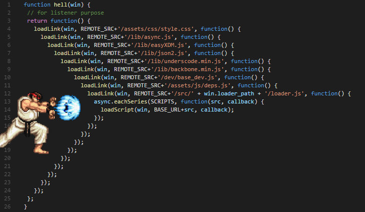

# Javascript 

### 비동기처리
- 자바스크립트는 싱글쓰레드기반 언어이다. => 모든 작업을 순서대로 진행

- 자바스크립트의 비동기 처리란 특정 코드의 연산이 끝날 때까지 `코드의 실행을 멈추지 않고` 다음 코드를 먼저 실행하는 자바스크립트의 특성

- `특정 로직의 실행이 끝날 때까지 기다려주지 않고 나머지 *코드*를 먼저 실행`하는 것이 비동기 처리이다.

- 자바스크립트에서 비동기 처리가 필요한 이유는 화면에서 서버로 데이터를 요청했을 때 서버가 언제 그 요청에 대한 응답을 줄지도 모르는데 마냥 다른 코드를 실행 안 하고 기다릴 순 없기 때문이다.

반대로 동기식 프로그래밍은 A 를 처리하고, B 를 `순차적`으로 처리한다.

1 . jQuery의 ajax
```js
function getData() {
	var tableData;
	$.get('https://domain.com/products/1', function (response) {
		tableData = response;
	});
  return tableData;
  // 요청을 받아올때까지 기다리지 않고, return tableDate를 실행함 
}
console.log(getData()); // undefined
```

2 . setTimeOut()
```js
// 1
console.log('Hello');
// 2
setTimeout(function () {
	console.log('Bye');
}, 3000);
// 3
console.log('Hello Again');

// 위 코드를 실행하면 1 => 3 => (3초뒤에)2 의 순서대로 실행된다.
```

### 자바스크립트 비동기처리의 문제점
- 자바스크립트는 응답이 끝난 후, 다음 코드를 실행시키지 않는다.
- 여기서 이야기할 주제인 `콜백함수`를 사용하면 특정로직이 끝났을때, 다음 코드를 실행할 수 있다.
- 모든 명령의 실행을 마친 후 넘겨받은 함수(객체)를 실행하는 것
:: 자바스크립트에서는 함수도 객체이기때문에 인자로 함수에 함수를 넘길 수 있다. 또한, 넘겨받은 함수(객체)를 언제 실행할지 결정할 수 있다.
:: 우리가 생각한 대로 코드 흐름을 만들 수 있다는 얘기

### 콜백함수
- 예시
```js
// 1. doHomework() 함수
function doHomework(subject) {
  alert(`Starting my ${subject} homework.`);
}
// 함수 선언
doHomework('math');
// Alerts: Starting my math homework.

// 2. 콜백함수 만들기 :: 두번째 인자로 callback를 넘겨줌
function doHomework(subject, callback) {
  alert(`Starting my ${subject} homework.`);
  callback();
}
doHomework('math', function() {
  alert('Finished my homework');
});
// 2개의 alert이 뜬다. Starting my subject homework => Finished blabla
```
> **Note**
  1. 사실 콜백 함수를 꼭 함수 호출 시에 정의할 필요는 없다. 콜백함수는 스크립트의 어느 부분에서라도 정의될 수 있다.
```js
function doHomework(subject, callback) {
  alert(`Starting my ${subject} homework.`);
  callback();
}
function alertFinished(){
  alert('Finished my homework');
}
doHomework('math', alertFinished);
```

### ! 콜백함수에도 문제점이 있다.

- Callback 함수가 그 결과 값을 가지고 Callback을 다시 호출하고, 그 결과 값으로 또 다시 Callback을 호출하게 되면 발생한다.

### 결론
- Callback함수는 Promise로 보완할 수 있다.
- Promise는 Generator로 보완할 수 있다.
- 나아가 비동기 프로그래밍을 쉽게 해주는 async/await을 도입되었다.
> 지원되지 않는 브라우저가 있기 때문에 Babel을 통해 컴파일 해야한다.
 

### Asynchronous & Synchronous 차이점 및 특징
- 데이터를 받는 방식
1. 비동기
  - `동시에 존재하지 않는`
  - A코드를 비동기식으로 동작시키면, A코드에게 ‘시작해라’ 명령을 내린 뒤, B코드를 실행한다. 그리고 A코드는 수행이 완료되는대로 결과를 출력한다.
2. 동기
  - `동시에 일어나는`
  - 프로그래밍에서 동기식이란, A코드와 B코드가 있을 때, A코드가 모두 진행될 때 까지 B코드는 대기한다.