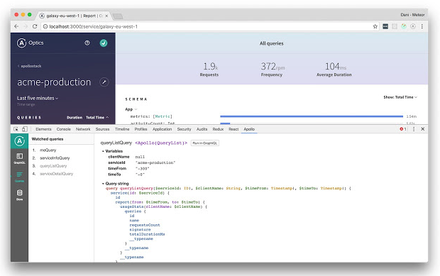

# 1. Installation 
```
yarn install apollo-boost react-apollo graphql
```
- yarn은 자바스크립트의 새로운 패키지 매니저이다. 자바스크립트에서 패키지매니저의 역할은 코드의 패키지를 공유하고 조립하여 프로젝트를 빌드한다. `npm`이 그 대표이다. npm의 단점을 보완해주는 패키지 매니저가 바로 `yarn`이다. 보다 빠르고, 안정적이며 보안성이 뛰어나다. 
1. 설치하기 (macOS기준)
```
brew install yarn
```
다시 Apollo client로 돌아와서, 첫줄의 명령어로 몇가지 패키지들을 install한다.

# 2. Create a client
먼저 `apollo-boost`에서 `ApolloClient`를 import해서 client를 생성한다. 
```js
import ApolloClient from "apollo-boost";
const client = new ApolloClient({
  uri: "https://48p1r2roz4.sse.codesandbox.io"
});
```
위와 같은 문법으로 client 객체를 생성하는데, `uri`속성에 서버의 주소를 담는다.
그리고 서버에 쿼리를 날리는 방법은 두 가지가 있다. 

:one: :pencil2: client에 직접 .query()메소드로 요청을 보내는 방법

:two: :pencil2: Connect your client to React

나는 현재 리액트 프로젝트를 진행중이기 때문에 두번째 방법으로 진행하려한다.
```js
import { ApolloProvider } from "react-apollo";
```
그리고 `index.js` 파일에 `ApolloProvider`로 감싸주고, client속성에 client(서버가 저장된 변수)를 넘겨주면 ApolloProvider 안에서 렌더링되는 모든 컴포넌트에서 서버와 연결이 가능하다. 
```js
const App = () => (
  <ApolloProvider client={client}>
    <div>
      <h2>My first Apollo app 🚀</h2>
    </div>
    // ... <blabla />
    // ... <blablabla />
    // ...컴포넌트가 들어올 자리
    // =>  <Component {...pageProps} />
  </ApolloProvider>
);

render(<App />, document.getElementById("root"));
```

# 3. Request data
`ApolloProvider`로 컴포넌트들을 감쌌으면, 쿼리를 보낼 <Query> 컴포넌트를 작성한다.
```js
import { Query } from "react-apollo";
import { gql } from "apollo-boost";
```
을 통해 Query컴포넌트와 gql문법이 사용가능하다.
```js
const ExchangeRates = () => (
  <Query
    query={gql`
      {
        rates(currency: "USD") {
          currency
          rate
        }
      }
    `}
  >
    {({ loading, error, data }) => {
      if (loading) return <p>Loading...</p>;
      if (error) return <p>Error :(</p>;

      return data.rates.map(({ currency, rate }) => (
        <div key={currency}>
          <p>{currency}: {rate}</p>
        </div>
      ));
    }}
  </Query>
);
```
<Query> 컴포넌트에게 ExchangeRates라는 변수명을 붙여주고, App 컴포넌트에서 `ApolloProvider`로 감싸서 렌더링 하는 코드를 작성한다.
그럼 실제 데이터에 접근해서 렌더링된다! :notes:

### :seedling: withou Apollo-boost
위 예제에서는 Apllo-boost를 사용했지만, Apollo-boost 없이 설정할 수 있다.
Apollo-boost는 ApolloClient를 빠르게 시작할 수 있는 좋은 방법이지만, 기본적으로 지원하지 않는 기능들이 많다. 

:pencil2: 수동으로 Apollo Client를 생성하면 사용할 수 있는 기능들
> - apollo-client
> - apollo-cache-inmemory : 캐싱관리
> - apollo-link-http : 데이터를 가져오기위한 링크
> - apollo-link-error
> - apollo-link-state

#### :hear_no_evil: How to
ApolloClient를 초기화해야한다.
```
yarn install apollo-client apollo-cache-inmemory apollo-link-http apollo-link-error apollo-link graphql-tag --save
```
```js
import { ApolloClient } from 'apollo-client';
import { InMemoryCache } from 'apollo-cache-inmemory';
import { HttpLink } from 'apollo-link-http';
import { onError } from 'apollo-link-error';
import { ApolloLink } from 'apollo-link';

const client = new ApolloClient({
  link: ApolloLink.from([
    onError(({ graphQLErrors, networkError }) => {
      if (graphQLErrors)
        graphQLErrors.map(({ message, locations, path }) =>
          console.log(
            `[GraphQL error]: Message: ${message}, Location: ${locations}, Path: ${path}`,
          ),
        );
      if (networkError) console.log(`[Network error]: ${networkError}`);
    }),
    new HttpLink({
      uri: 'https://w5xlvm3vzz.lp.gql.zone/graphql',
      credentials: 'same-origin'
    })
  ]),
  cache: new InMemoryCache()
});
```
- `InMemoryCache` : 권장 캐시구현이다.
- `HttpLink` : HTTP 요청을 보내는 링크  
- new ApolloClient => `ApolloClient` 내보낼 옵션을 전달 수 있다.
  + **uri** : string
  + **fetchOptions** : 객체
  + **request** : (operation: Operation) => Promise
  + **onError**
  + **clientState**
  + **cacheRedirects**
  + **credentials**
  + **header**
  + **fetch**
  + **cache**

# 브라우저에서 Apollo
- [Apollo Client Developer Tools](https://chrome.google.com/webstore/detail/apollo-client-developer-t/jdkknkkbebbapilgoeccciglkfbmbnfm)



## 정리
- Apollo Client를 사용하여 데이터를 가져오는 방법을 알았다. 
- :pencil2: NEXT STEP :pencil2: 복잡한 query와 mutation 에 대해!